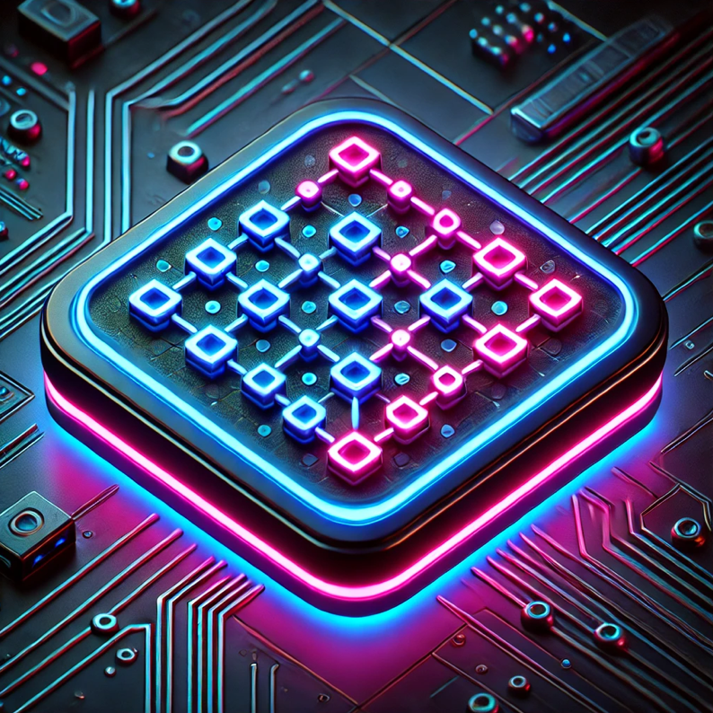

# Dots and Boxes

<div align="center">
     
</div>

---

The **Dots and Boxes** app is a two-player pencil-and-paper game written in [Go](https://go.dev/), using the [Fyne](https://fyne.io/) framework for the frontend, with the remote server built on [Gin](https://gin-gonic.com/).

### Game Rule

The game starts with an empty grid of dots. Usually two players take turns adding a single horizontal or vertical line between two unjoined adjacent dots. A player who completes the fourth side of a 1×1 box earns one point and takes another turn. A point is typically recorded by placing a mark that identifies the player in the box, such as an initial. The game ends when no more lines can be placed. The winner is the player with the most points. The board may be of any size grid. (Referenced from [Wikipedia](https://en.wikipedia.org/wiki/Dots_and_boxes))

### AI Model

We implemented seven levels of AI. They are as follows:

- [Level 0 Model](src/ai/L0Model.go): Returns the edges on the board where a score can be obtained; if none are available, it avoids edges where the opponent can score.
- [Level 1 Model](src/ai/L1Model.go): Returns the edges on the board where a score can be obtained; if none are available, and if the opponent will inevitably score, it returns the edge that minimizes the opponent’s score.
- [Level 2 Model](src/ai/L2Model.go): This model only activates during the endgame (the endgame is defined as when all positions on the board have at least two empty edges). If it is not in the endgame, it returns the result of the Level 3 Model. During the endgame, it sequentially adds an empty edge to the board and simulates a match between two Level 3 Models, returning the edge with the best outcome from the simulated match.
- [Level 3 Model](src/ai/L3Model.go): The Level 5 Model considers all the best edges from the Level 4 Model as candidate edges and conducts several simulations of matches between two designated Models. From the results of N simulations, it selects the candidate edge that performs the best.
- [Level 4 Model](src/ai/L4Model.go): The Level 6 Model runs CPU number instances of the designated Model in parallel, collects the results from all Level 5 Models, and selects the best edge based on the aggregated results.

### Getting Started

To get started with **Dots and Boxes**, follow the steps below:

#### Prerequisites

1. Clone the repository:

```bash
$ git clone https://github.com/HuXin0817/dots-and-boxes.git
$ cd dots-and-boxes
```

2. Install the dependencies:

```bash
$ go mod tidy
```

3. Run server:

```bash
$ go run ./server -f server/etc/config.yaml
```

4. Run app:

```bash
$ go run ./app
```

### License

This project is licensed under the MIT License - see the [LICENSE](LICENSE) file for details.
